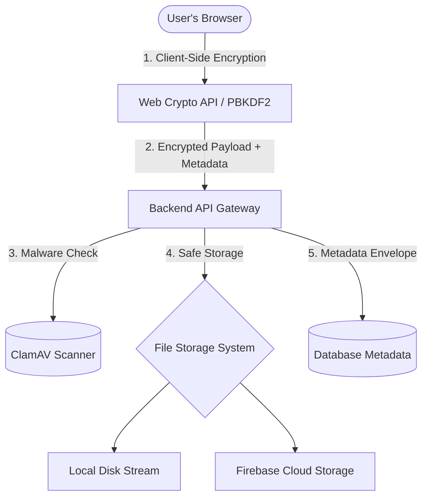

# SecuLink 🔒

SecuLink is a modern, high-security web application designed to share sensitive files, documents, and notes. Using advanced client-side cryptography, it ensures that your files and messages are shared securely and self-destruct automatically based on rules you control.

---

## 🚀 Live Demo & Screenshots

### 🌐 Live Demo
*Coming soon!* Check back here once the live staging environment link is configured.

### 📸 Screenshots
*(Add your screenshots below to visualize the user flow)*
<table>
  <tr>
    <td width="50%">
      <p align="center"><b>Page 1: Landing Page</b></p>
      <!--  -->
      <p align="center"><i>Landing screen showing how SecuLink secure vault works</i></p>
    </td>
    <td width="50%">
      <p align="center"><b>Page 2: Secure Upload Panel</b></p>
      <!--  -->
      <p align="center"><i>Main uploader panel with advanced security controls accordion</i></p>
    </td>
  </tr>
</table>

---

## ✨ Key Features

- **Private & Secure Storage**: Files and text notes are encrypted inside your browser before uploading. The server never sees your passwords or unencrypted files.
- **Self-Destructing Links**: Set sharing links to automatically expire after a few minutes or hours.
- **Password Locked**: Secure files with custom access passwords so only authorized people can view them.
- **One-Time Downloads (Burn-on-Read)**: Make sharing links destroy themselves immediately after the file is downloaded once.
- **Country & Time Limits (Geofencing)**: Restrict file downloads to specific countries (e.g., India, Singapore, USA) or set active hours of the day when the link is available.
- **IP Address Lock**: Ensure only specific IP addresses can open your shared links.
- **Email Passcode Verification (OTP)**: Send a secure verification code directly to the recipient's email before letting them open the file.
- **Mobile QR Codes**: Instantly scan dynamic QR codes to access files securely from a smartphone.
- **Secure View-Only Mode**: Display documents directly in the browser with disabled download buttons, disabled right-click, and custom watermarks showing the recipient's IP.
- **Sensitive Data Scanner**: Scans and warns you automatically if you are uploading files containing credit cards, passwords, or API keys.
- **Secure Ephemeral Chat**: Exchange end-to-end encrypted notes and text messages inside the same self-destructing vault.
- **Activity & History Logs**: Track when sharing links are created, accessed, or shredded.
- **Emergency Wipe (System Nuke)**: A single click destroys all active file sharing allocations and wipes metadata from the database instantly.

---

## 🏗️ System Architecture

SecuLink is designed around security, privacy, and zero-knowledge storage.



### 💻 Frontend
Built using **React** and **TypeScript** with custom **Vanilla CSS** for a highly responsive, modern interface.
- Handles browser-side theme toggling (light/dark mode).
- Derives client-side encryption keys using **PBKDF2/WebCrypto APIs** so raw secrets never leave the client.
- Scans files locally for sensitive credentials before upload.
- Displays responsive document preview frames in view-only mode and handles QR code rendering.

### 🔒 Encryption Layer
A hybrid encryption engine combining local zero-knowledge capabilities and server-assisted envelope wrappers:
- Raw files are encrypted client-side using **AES-256-GCM**.
- Key parameters (salt, IV, auth tags) are either derived on the client or encrypted using **AES-256-CBC** with a server-managed master key to form database security envelopes.

### ⚙️ Backend API
A **Node.js Express** server that coordinates access control and transfer security:
- Validates structural permissions, IP locks, geographic regions, and active time windows.
- Performs automated file sanitization and malware checking.
- Dispatches SMTP authentication mailers and one-time verification passcodes (OTP).
- Cleans and prunes expired files automatically using a recurring background worker.

### 🗄️ Database
Uses **Sequelize ORM** to coordinate metadata persistence:
- Supports **SQLite** for light local execution and **PostgreSQL** for scalable production setups.
- Records vault parameters, expiring leases, access logs, and encrypted ephemeral chat messages.

### 📦 File Storage
Manages physical payload distribution:
- Streams file uploads to disk in small chunks to protect backend memory consumption.
- Integrates easily with **Firebase Cloud Storage** or local directory volumes.

---

## 🔌 Core API Endpoints

### 📤 Upload Endpoint
* **Endpoint**: `POST /api/vault/upload`
* **Why we use it**: 
  This endpoint is the entry point for vault uploads. It receives file payloads, runs an automated anti-malware scan, checks file formats, and writes the encrypted payload to the storage provider. It then saves key settings (such as passwords, expiration times, IP/country restrictions, and recipient emails) as metadata records in the database, returning a unique secure share link.

### 🔑 Other Key Endpoints
* **`POST /api/vault/signed-upload-url`**: Generates a temporary direct link so clients can upload larger payloads straight to Firebase storage without overloading server threads.
* **`PUT /api/vault/direct-upload/:fileHash`**: Stream-writes direct payloads to local server storage volumes.
* **`GET /api/vault/challenge/:uuid`**: Validates security criteria (expiry, IP restriction, geofence country, active hours) and lets the client know whether password inputs or OTP validation are required.
* **`POST /api/vault/otp-request/:uuid`**: Dispatches a 6-digit verification code to the recipient's verified email address.
* **`POST /api/vault/otp-verify/:uuid`**: Validates the recipient's OTP code.
* **`POST /api/vault/download/:uuid`**: Serves the encrypted payload, notifications, and handles automatic destruction (Burn-on-Read).
* **`POST /api/vault/chat-send/:uuid` & `POST /api/vault/chat-logs/:uuid`**: Handles encrypted messaging inside the temporary vault.
* **`GET /api/vault/logs/:uuid`**: Returns transaction logs for review.
* **`POST /api/vault/nuke`**: Triggers immediate erasure of all files and logs.

---

## 🛠️ Installation & Setup

1. **Clone the Repository**
   ```bash
   git clone https://github.com/Susheyyy/SecuLink.git
   cd SecuLink
   ```

2. **Backend Config & Launch**
   ```bash
   cd backend
   npm install
   ```
   Create a `.env` file from the example template:
   ```bash
   cp .env.example .env
   ```
   *Edit `.env` to configure your custom `SECRET_KEY`, SMTP parameters, and storage setup.*
   
   Run the backend development server:
   ```bash
   npm run dev
   ```

3. **Frontend Config & Launch**
   ```bash
   cd ../frontend
   npm install
   npm run dev
   ```

4. **Verify Application**
   Open `http://localhost:5173` in your browser to test file sharing, security gates, and audit trails.
